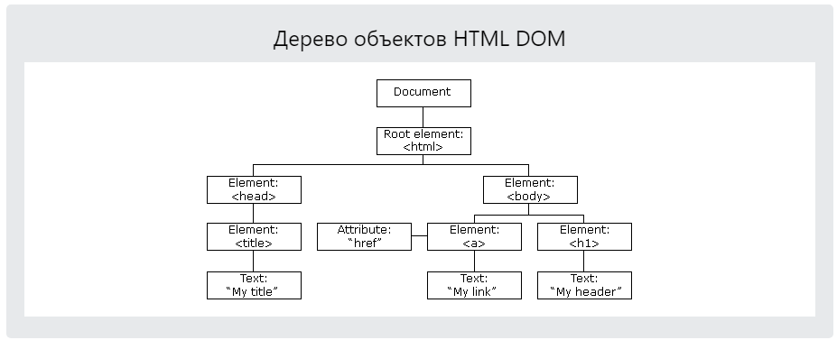
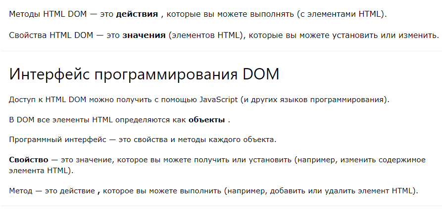
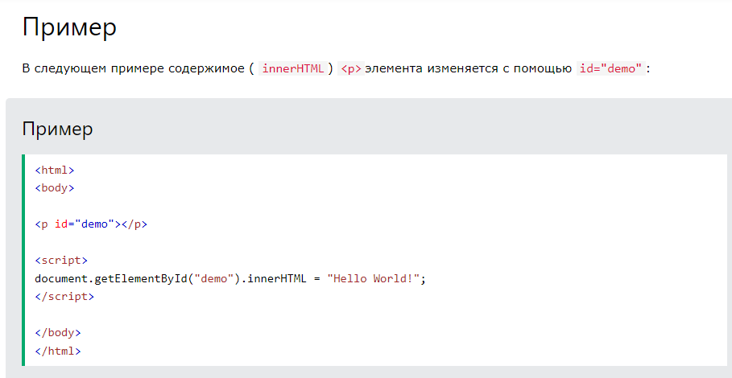
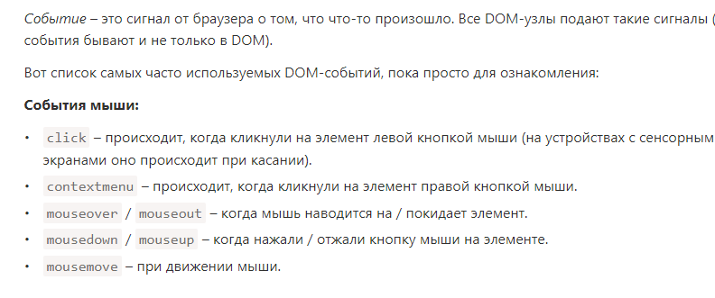
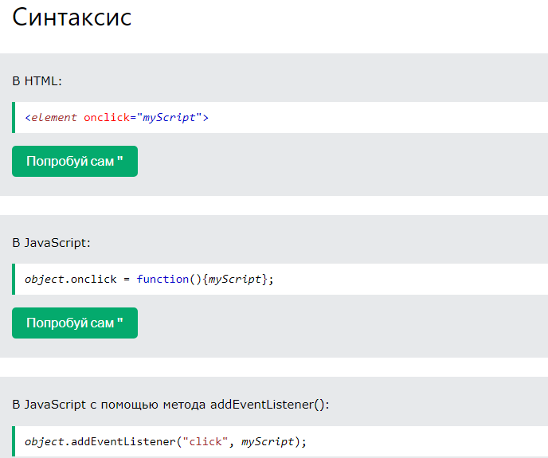

# JavaScript HTML DOM

> С помощью HTML DOM JavaScript может получать доступ ко всем элементам HTML-документа и изменять их.

#### HTML DOM (объектная модель документа)

> Когда веб-страница загружается, браузер создает объектную модель документа страницы .

Модель HTML DOM построена как дерево объектов :
[
[
[
[
[
[
[
